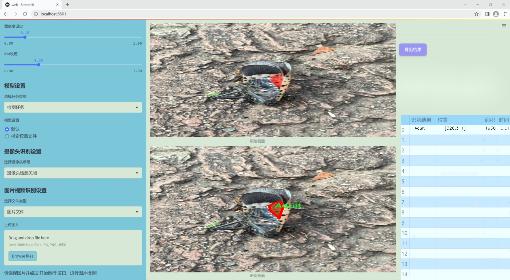
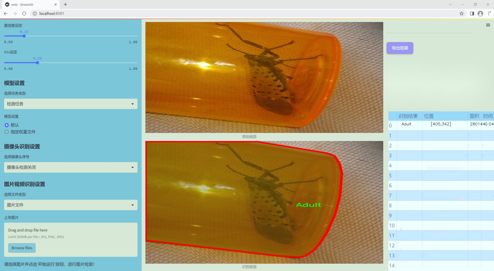
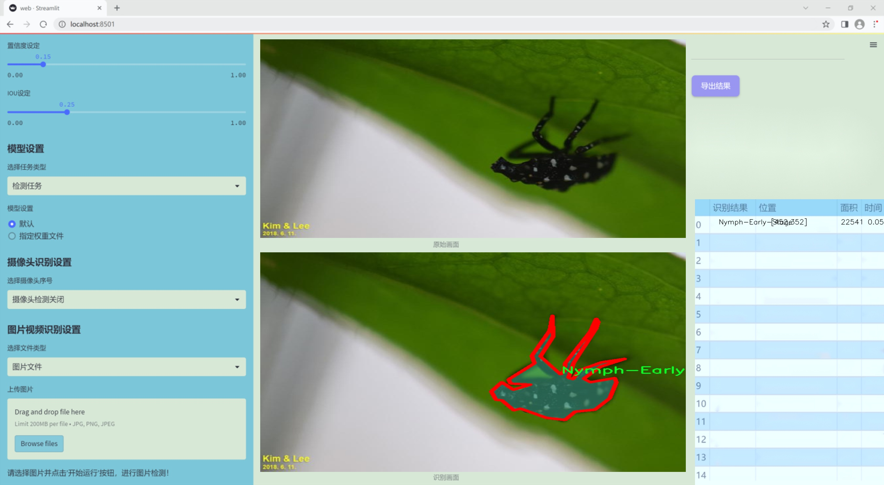
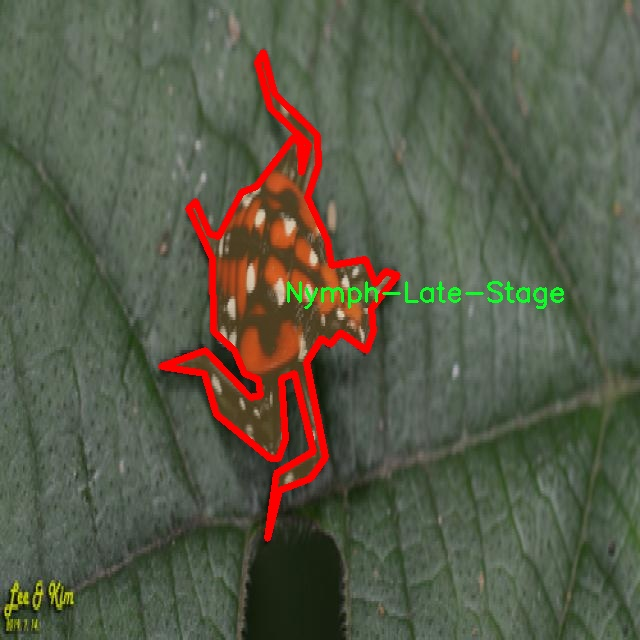
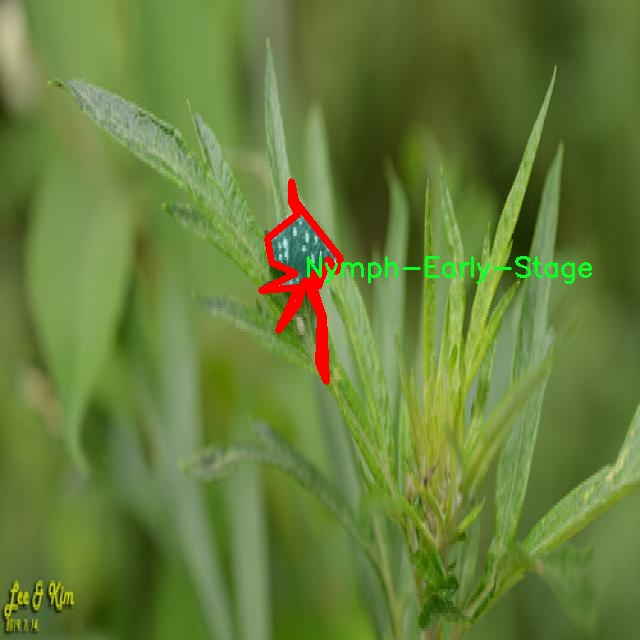

### 1.背景意义

研究背景与意义

昆虫在生态系统中扮演着至关重要的角色，其生命周期的各个阶段对生态平衡、农业生产及生物多样性保护均有深远影响。随着全球气候变化和人类活动的加剧，昆虫种群的变化及其生命周期的研究变得愈发重要。传统的昆虫生命周期阶段识别方法依赖于人工观察和分类，效率低下且容易受到主观因素的影响。因此，开发一种高效、准确的自动识别系统显得尤为必要。

基于改进YOLOv11的昆虫生命周期阶段识别系统，旨在利用深度学习技术，特别是目标检测和实例分割的最新进展，来实现对昆虫生命周期各阶段的自动识别。该系统将使用一个包含1200张图像的数据集，涵盖四个主要类别：成虫、卵、早期若虫和晚期若虫。通过对这些类别的准确识别，研究者可以更好地理解昆虫的生长发育规律，进而为生态监测、农业害虫管理及生物控制策略的制定提供科学依据。

此外，随着计算机视觉技术的不断发展，基于深度学习的模型在图像识别领域取得了显著的进展。YOLOv11作为一种高效的目标检测算法，能够在保证高精度的同时实现实时处理，为昆虫生命周期阶段的识别提供了强有力的技术支持。通过对数据集的精细标注和模型的不断优化，预计该系统能够在实际应用中展现出良好的性能，推动昆虫学及相关领域的研究进展。

综上所述，基于改进YOLOv11的昆虫生命周期阶段识别系统不仅能够提升昆虫分类的效率和准确性，还将为生态研究和农业实践提供重要的技术支持，具有重要的学术价值和实际应用意义。

### 2.视频效果

[2.1 视频效果](https://www.bilibili.com/video/BV1fCk9YhEnG/)

### 3.图片效果







##### [项目涉及的源码数据来源链接](https://kdocs.cn/l/cszuIiCKVNis)**

注意：本项目提供训练的数据集和训练教程,由于版本持续更新,暂不提供权重文件（best.pt）,请按照6.训练教程进行训练后实现上图演示的效果。

### 4.数据集信息

##### 4.1 本项目数据集类别数＆类别名

nc: 4
names: ['Adult', 'Eggs', 'Nymph-Early-Stage', 'Nymph-Late-Stage']


该项目为【图像分割】数据集，请在【训练教程和Web端加载模型教程（第三步）】这一步的时候按照【图像分割】部分的教程来训练

##### 4.2 本项目数据集信息介绍

本项目数据集信息介绍

本项目所使用的数据集名为“TrainingDataiWatch”，旨在为改进YOLOv11的昆虫生命周期阶段识别系统提供丰富的训练素材。该数据集专注于昆虫的不同生命周期阶段，涵盖了四个主要类别，分别是“Adult”（成虫）、“Eggs”（卵）、“Nymph-Early-Stage”（早期若虫）和“Nymph-Late-Stage”（晚期若虫）。这些类别的选择不仅反映了昆虫生命周期的基本构成，也为模型的训练提供了多样化的样本，使其能够更好地识别和分类不同阶段的昆虫。

数据集中的样本来源广泛，涵盖了多种昆虫种类和生态环境，确保了训练数据的多样性和代表性。每个类别的样本均经过精心标注，确保了数据的准确性和可靠性。成虫样本展示了昆虫在成熟阶段的特征，而卵样本则提供了早期发育阶段的关键数据。早期若虫和晚期若虫的样本则帮助模型学习到不同发育阶段的形态变化。这种分阶段的分类方式不仅有助于提高模型的识别精度，也为后续的昆虫生态研究提供了重要的数据支持。

通过使用“TrainingDataiWatch”数据集，改进后的YOLOv11模型将能够更准确地识别昆虫的生命周期阶段，从而为昆虫监测、生态研究和农业管理等领域提供强有力的技术支持。数据集的构建和使用不仅体现了对昆虫生物学的深入理解，也展示了计算机视觉技术在生物识别领域的广泛应用潜力。







### 5.全套项目环境部署视频教程（零基础手把手教学）

[5.1 所需软件PyCharm和Anaconda安装教程（第一步）](https://www.bilibili.com/video/BV1BoC1YCEKi/?spm_id_from=333.999.0.0&vd_source=bc9aec86d164b67a7004b996143742dc)


[5.2 安装Python虚拟环境创建和依赖库安装视频教程（第二步）](https://www.bilibili.com/video/BV1ZoC1YCEBw?spm_id_from=333.788.videopod.sections&vd_source=bc9aec86d164b67a7004b996143742dc)

### 6.改进YOLOv11训练教程和Web_UI前端加载模型教程（零基础手把手教学）

[6.1 改进YOLOv11训练教程和Web_UI前端加载模型教程（第三步）](https://www.bilibili.com/video/BV1BoC1YCEhR?spm_id_from=333.788.videopod.sections&vd_source=bc9aec86d164b67a7004b996143742dc)


按照上面的训练视频教程链接加载项目提供的数据集，运行train.py即可开始训练



     Epoch   gpu_mem       box       obj       cls    labels  img_size
     1/200     20.8G   0.01576   0.01955  0.007536        22      1280: 100%|██████████| 849/849 [14:42<00:00,  1.04s/it]
               Class     Images     Labels          P          R     mAP@.5 mAP@.5:.95: 100%|██████████| 213/213 [01:14<00:00,  2.87it/s]
                 all       3395      17314      0.994      0.957      0.0957      0.0843

     Epoch   gpu_mem       box       obj       cls    labels  img_size
     2/200     20.8G   0.01578   0.01923  0.007006        22      1280: 100%|██████████| 849/849 [14:44<00:00,  1.04s/it]
               Class     Images     Labels          P          R     mAP@.5 mAP@.5:.95: 100%|██████████| 213/213 [01:12<00:00,  2.95it/s]
                 all       3395      17314      0.996      0.956      0.0957      0.0845

     Epoch   gpu_mem       box       obj       cls    labels  img_size
     3/200     20.8G   0.01561    0.0191  0.006895        27      1280: 100%|██████████| 849/849 [10:56<00:00,  1.29it/s]
               Class     Images     Labels          P          R     mAP@.5 mAP@.5:.95: 100%|███████   | 187/213 [00:52<00:00,  4.04it/s]
                 all       3395      17314      0.996      0.957      0.0957      0.0845


###### [项目数据集下载链接](https://kdocs.cn/l/cszuIiCKVNis)

### 7.原始YOLOv11算法讲解

##### YOLO11简介

> YOLO11源码地址：https://github.com/ultralytics/ultralytics

Ultralytics
YOLO11是一款尖端的、最先进的模型，它在之前YOLO版本成功的基础上进行了构建，并引入了新功能和改进，以进一步提升性能和灵活性。YOLO11设计快速、准确且易于使用，使其成为各种物体检测和跟踪、实例分割、图像分类以及姿态估计任务的绝佳选择。  


**YOLO11创新点如下:**

YOLO 11主要改进包括：  
`增强的特征提取`：YOLO 11采用了改进的骨干和颈部架构，增强了特征提取功能，以实现更精确的目标检测。  
`优化的效率和速度`：优化的架构设计和优化的训练管道提供更快的处理速度，同时保持准确性和性能之间的平衡。  
`更高的精度，更少的参数`：YOLO11m在COCO数据集上实现了更高的平均精度（mAP），参数比YOLOv8m少22%，使其在不影响精度的情况下提高了计算效率。  
`跨环境的适应性`：YOLO 11可以部署在各种环境中，包括边缘设备、云平台和支持NVIDIA GPU的系统。  
`广泛的支持任务`：YOLO 11支持各种计算机视觉任务，如对象检测、实例分割、图像分类、姿态估计和面向对象检测（OBB）。

**YOLO11不同模型尺寸信息：**

YOLO11 提供5种不同的型号规模模型，以满足不同的应用需求：

Model| size (pixels)| mAPval 50-95| Speed CPU ONNX (ms)| Speed T4 TensorRT10
(ms)| params (M)| FLOPs (B)  
---|---|---|---|---|---|---  
YOLO11n| 640| 39.5| 56.1 ± 0.8| 1.5 ± 0.0| 2.6| 6.5  
YOLO11s| 640| 47.0| 90.0 ± 1.2| 2.5 ± 0.0| 9.4| 21.5  
YOLO11m| 640| 51.5| 183.2 ± 2.0| 4.7 ± 0.1| 20.1| 68.0  
YOLO11l| 640| 53.4| 238.6 ± 1.4| 6.2 ± 0.1| 25.3| 86.9  
YOLO11x| 640| 54.7| 462.8 ± 6.7| 11.3 ± 0.2| 56.9| 194.9  
  
**模型常用训练超参数参数说明：**  
`YOLOv11
模型的训练设置包括训练过程中使用的各种超参数和配置`。这些设置会影响模型的性能、速度和准确性。关键的训练设置包括批量大小、学习率、动量和权重衰减。此外，优化器、损失函数和训练数据集组成的选择也会影响训练过程。对这些设置进行仔细的调整和实验对于优化性能至关重要。  
**以下是一些常用的模型训练参数和说明：**

参数名| 默认值| 说明  
---|---|---  
`model`| `None`| 指定用于训练的模型文件。接受指向 `.pt` 预训练模型或 `.yaml`
配置文件。对于定义模型结构或初始化权重至关重要。  
`data`| `None`| 数据集配置文件的路径（例如
`coco8.yaml`).该文件包含特定于数据集的参数，包括训练数据和验证数据的路径、类名和类数。  
`epochs`| `100`| 训练总轮数。每个epoch代表对整个数据集进行一次完整的训练。调整该值会影响训练时间和模型性能。  
`patience`| `100`| 在验证指标没有改善的情况下，提前停止训练所需的epoch数。当性能趋于平稳时停止训练，有助于防止过度拟合。  
`batch`| `16`| 批量大小，有三种模式:设置为整数(例如，’ Batch =16 ‘)， 60% GPU内存利用率的自动模式(’ Batch
=-1 ‘)，或指定利用率分数的自动模式(’ Batch =0.70 ')。  
`imgsz`| `640`| 用于训练的目标图像尺寸。所有图像在输入模型前都会被调整到这一尺寸。影响模型精度和计算复杂度。  
`device`| `None`| 指定用于训练的计算设备：单个 GPU (`device=0`）、多个 GPU (`device=0,1`)、CPU
(`device=cpu`)，或苹果芯片的 MPS (`device=mps`).  
`workers`| `8`| 加载数据的工作线程数（每 `RANK` 多 GPU 训练）。影响数据预处理和输入模型的速度，尤其适用于多 GPU 设置。  
`name`| `None`| 训练运行的名称。用于在项目文件夹内创建一个子目录，用于存储训练日志和输出结果。  
`pretrained`| `True`| 决定是否从预处理模型开始训练。可以是布尔值，也可以是加载权重的特定模型的字符串路径。提高训练效率和模型性能。  
`optimizer`| `'auto'`| 为训练模型选择优化器。选项包括 `SGD`, `Adam`, `AdamW`, `NAdam`,
`RAdam`, `RMSProp` 等，或 `auto` 用于根据模型配置进行自动选择。影响收敛速度和稳定性  
`lr0`| `0.01`| 初始学习率（即 `SGD=1E-2`, `Adam=1E-3`) .调整这个值对优化过程至关重要，会影响模型权重的更新速度。  
`lrf`| `0.01`| 最终学习率占初始学习率的百分比 = (`lr0 * lrf`)，与调度程序结合使用，随着时间的推移调整学习率。  


**各损失函数作用说明：**  
`定位损失box_loss`：预测框与标定框之间的误差（GIoU），越小定位得越准；  
`分类损失cls_loss`：计算锚框与对应的标定分类是否正确，越小分类得越准；  
`动态特征损失（dfl_loss）`：DFLLoss是一种用于回归预测框与目标框之间距离的损失函数。在计算损失时，目标框需要缩放到特征图尺度，即除以相应的stride，并与预测的边界框计算Ciou
Loss，同时与预测的anchors中心点到各边的距离计算回归DFLLoss。  


### 8.200+种全套改进YOLOV11创新点原理讲解

#### 8.1 200+种全套改进YOLOV11创新点原理讲解大全

由于篇幅限制，每个创新点的具体原理讲解就不全部展开，具体见下列网址中的改进模块对应项目的技术原理博客网址【Blog】（创新点均为模块化搭建，原理适配YOLOv5~YOLOv11等各种版本）

[改进模块技术原理博客【Blog】网址链接](https://gitee.com/qunmasj/good)


#### 8.2 精选部分改进YOLOV11创新点原理讲解

###### 这里节选部分改进创新点展开原理讲解(完整的改进原理见上图和[改进模块技术原理博客链接](https://gitee.com/qunmasj/good)【如果此小节的图加载失败可以通过CSDN或者Github搜索该博客的标题访问原始博客，原始博客图片显示正常】
### 可变性卷积DCN简介
卷积神经网络由于其构建模块中固定的几何结构，本质上受限于模型几何变换。为了提高卷积神经网络的转换建模能力，《Deformable Convolutional Networks》作者提出了两个模块：可变形卷积（deformable convolution）和可变形RoI池（deformable RoI pooling）。这两个模块均基于用额外的偏移来增加模块中的空间采样位置以及从目标任务中学习偏移的思想，而不需要额外的监督。

第一次证明了在深度神经网络中学习密集空间变换（dense spatial transformation）对于复杂的视觉任务是有效的

视觉识别中的一个关键挑战是如何适应对象比例、姿态、视点和零件变形中的几何变化或模型几何变换。一般有两种方法实现：
1）建立具有足够期望变化的训练数据集。这通常通过增加现有的数据样本来实现，例如通过仿射变换。但是训练成本昂贵而且模型参数庞大。
2）使用变换不变（transformation-invariant）的特征和算法。比如比较有名的SIFT(尺度不变特征变换)便是这一类的代表算法。

但以上的方法有两个缺点：
1）几何变换被假定为固定的和已知的，这些先验知识被用来扩充数据，设计特征和算法。为此，这个假设阻止了对具有未知几何变换的新任务的推广，从而导致这些几何变换可能没有被正确建模。
2）对于不变特征和算法进行手动设计，对于过于复杂的变换可能是困难的或不可行的。

卷积神经网络本质上局限于模拟大型未知转换。局限性源于CNN模块的固定几何结构：卷积单元在固定位置对输入特征图进行采样；池化层以固定比率降低特征矩阵分辨率；RoI（感兴趣区域）池化层将RoI分成固定的空间箱（spatial bins）等。缺乏处理几何变换的内部机制。

这种内部机制的缺乏会导致一些问题，举个例子。同一个CNN层中所有激活单元的感受野大小是相同的，但是这是不可取的。因为不同的位置可能对应于具有不同尺度或变形的对象，所以尺度或感受野大小的自适应确定对于具有精细定位的视觉识别是渴望的。

对于这些问题，作者提出了两个模块提高CNNs对几何变换建模的能力。


deformable convolution（可变形卷积）
将2D偏移量添加到标准卷积中的常规网格采样位置，使得采样网格能够自由变形。通过额外的卷积层，从前面的特征映射中学习偏移。因此，变形采用局部、密集和自适应的方式取决于输入特征。


deformable RoI pooling（可变形RoI池化）
为先前RoI池化的常规库（bin）分区中的每个库位置（bin partition）增加了一个偏移量。类似地，偏移是从前面的特征图和感兴趣区域中学习的，从而能够对具有不同形状的对象进行自适应部件定位（adaptive part localization）。

#### Deformable Convolutional Networks
Deformable Convolution
2D卷积由两个步骤组成：
1）在输入特征图x xx上使用规则网格R RR进行采样。
2）把这些采样点乘不同权重w ww后相加。

网格R定义感受野大小和扩张程度，比如内核大小为3x3，扩张程度为1的网格R可以表示为：
R = { ( − 1 , − 1 ) , ( − 1 , 0 ) , … , ( 0 , 1 ) , ( 1 , 1 ) } R = \{(-1,-1),(-1,0),\dots,(0,1),(1,1)\}
R={(−1,−1),(−1,0),…,(0,1),(1,1)}

​
 一般为小数，使用双线性插值进行处理。（把小数坐标分解到相邻的四个整数坐标点来计算结果）


具体操作如图所示：


首先对输入特征层进行一个普通的3x3卷积处理得到偏移域（offset field）。偏移域特征图具有与输入特征图相同的空间分辨率，channels维度2N对应于N个2D（xy两个方向）偏移。其中的N是原输入特征图上所具有的N个channels，也就是输入输出channels保持不变，这里xy两个channels分别对输出特征图上的一个channels进行偏移。确定采样点后就通过与相对应的权重w点乘相加得到输出特征图上该点最终值。

前面也提到过，由于这里xy两个方向所训练出来的偏移量一般来说是一个小数，那么为了得到这个点所对应的数值，会采用双线性插值的方法，从最近的四个邻近坐标点中计算得到该偏移点的数值，公式如下：


具体推理过程见：双线性插值原理

#### Deformable RoI Poolingb
所有基于区域提议（RPN）的对象检测方法都使用RoI池话处理，将任意大小的输入矩形区域转换为固定大小的特征图。


 一般为小数，需要使用双线性插值进行处理。


具体操作如图所示：


当时看这个部分的时候觉得有些突兀，明明RoI池化会将特征层转化为固定尺寸的区域。其实，我个人觉得，这个部分与上述的可变性卷积操作是类似的。这里同样是使用了一个普通的RoI池化操作，进行一些列处理后得到了一个偏移域特征图，然后重新作用于原来的w × H w \times Hw×H的RoI。只不过这里不再是规律的逐行逐列对每个格子进行池化，而是对于格子进行偏移后再池化处理。

#### Postion﹣Sensitive RoI Pooling
除此之外，论文还提出一种PS RoI池化（Postion﹣Sensitive RoI Pooling）。不同于上述可变形RoI池化中的全连接过程，这里使用全卷积替换。

具体操作如图所示：


首先，对于原来的特征图来说，原本是将输入特征图上的RoI区域分成k × k k\times kk×k个bin。而在这里，则是将输入特征图进行卷积操作，分别得到一个channels为k 2 ( C + 1 ) k^{2}(C+1)k (C+1)的得分图（score maps）和一个channels为2 k 2 ( C + 1 ) 2k{2}(C+1)2k 2 (C+1)的偏移域（offset fields），这两个特征矩阵的宽高是与输入特征矩阵相同的。其中，得分图的channels中，k × k k \times kk×k分别表示的是每一个网格，C CC表示的检测对象的类别数目，1表示背景。而在偏移域中的2表示xy两个方向的偏移。
也就是说，在PS RoI池化中，对于RoI的每一个网格都独自占一个通道形成一层得分图，然后其对于的偏移量占两个通道。offset fields得到的偏移是归一化后的偏移，需要通过和deformable RoI pooling中一样的变换方式得到∆ p i j ∆p_{ij}∆p ij，然后对每层得分图进行偏移池化处理。最后处理完的结果就对应着最后输出的一个网格。所以其包含了位置信息。

原文论述为：


#### Understanding Deformable ConvNets
当可变形卷积叠加时，复合变形的效果是深远的。如图所示：


ps：a是标准卷积的固定感受野，b是可变形卷积的适应性感受野。

感受野和标准卷积中的采样位置在整个顶部特征图上是固定的(左)。在可变形卷积中，它们根据对象的比例和形状进行自适应调整(右)。


### 9.系统功能展示

图9.1.系统支持检测结果表格显示

  图9.2.系统支持置信度和IOU阈值手动调节

  图9.3.系统支持自定义加载权重文件best.pt(需要你通过步骤5中训练获得)

  图9.4.系统支持摄像头实时识别

  图9.5.系统支持图片识别

  图9.6.系统支持视频识别

  图9.7.系统支持识别结果文件自动保存

  图9.8.系统支持Excel导出检测结果数据


### 10. YOLOv11核心改进源码讲解

#### 10.1 kacn_conv.py

以下是经过简化和注释的核心代码部分，保留了主要的功能和结构，同时提供了详细的中文注释：

```python
import torch
import torch.nn as nn

class KACNConvNDLayer(nn.Module):
    def __init__(self, conv_class, norm_class, input_dim, output_dim, degree, kernel_size,
                 groups=1, padding=0, stride=1, dilation=1,
                 ndim: int = 2, dropout=0.0):
        super(KACNConvNDLayer, self).__init__()
        
        # 初始化参数
        self.inputdim = input_dim  # 输入维度
        self.outdim = output_dim    # 输出维度
        self.degree = degree         # 多项式的阶数
        self.kernel_size = kernel_size  # 卷积核大小
        self.padding = padding       # 填充
        self.stride = stride         # 步幅
        self.dilation = dilation     # 膨胀
        self.groups = groups         # 分组卷积的组数
        self.ndim = ndim             # 数据的维度（1D, 2D, 3D）
        
        # 初始化dropout层
        self.dropout = None
        if dropout > 0:
            if ndim == 1:
                self.dropout = nn.Dropout1d(p=dropout)
            elif ndim == 2:
                self.dropout = nn.Dropout2d(p=dropout)
            elif ndim == 3:
                self.dropout = nn.Dropout3d(p=dropout)

        # 参数验证
        if groups <= 0:
            raise ValueError('groups must be a positive integer')
        if input_dim % groups != 0:
            raise ValueError('input_dim must be divisible by groups')
        if output_dim % groups != 0:
            raise ValueError('output_dim must be divisible by groups')

        # 初始化层归一化和卷积层
        self.layer_norm = nn.ModuleList([norm_class(output_dim // groups) for _ in range(groups)])
        self.poly_conv = nn.ModuleList([conv_class((degree + 1) * input_dim // groups,
                                                   output_dim // groups,
                                                   kernel_size,
                                                   stride,
                                                   padding,
                                                   dilation,
                                                   groups=1,
                                                   bias=False) for _ in range(groups)])
        
        # 创建一个缓冲区用于多项式计算
        arange_buffer_size = (1, 1, -1,) + tuple(1 for _ in range(ndim))
        self.register_buffer("arange", torch.arange(0, degree + 1, 1).view(*arange_buffer_size))
        
        # 初始化卷积层权重
        for conv_layer in self.poly_conv:
            nn.init.normal_(conv_layer.weight, mean=0.0, std=1 / (input_dim * (degree + 1) * kernel_size ** ndim))

    def forward_kacn(self, x, group_index):
        # 前向传播函数，处理每个组的输入
        x = torch.tanh(x)  # 应用tanh激活函数
        x = x.acos().unsqueeze(2)  # 计算反余弦并增加维度
        x = (x * self.arange).flatten(1, 2)  # 乘以arange并展平
        x = x.cos()  # 计算余弦
        x = self.poly_conv[group_index](x)  # 通过对应的卷积层
        x = self.layer_norm[group_index](x)  # 进行层归一化
        if self.dropout is not None:
            x = self.dropout(x)  # 应用dropout
        return x

    def forward(self, x):
        # 前向传播函数，处理整个输入
        split_x = torch.split(x, self.inputdim // self.groups, dim=1)  # 按组分割输入
        output = []
        for group_ind, _x in enumerate(split_x):
            y = self.forward_kacn(_x.clone(), group_ind)  # 处理每个组
            output.append(y.clone())  # 收集输出
        y = torch.cat(output, dim=1)  # 拼接输出
        return y

# 1D、2D和3D卷积层的具体实现
class KACNConv3DLayer(KACNConvNDLayer):
    def __init__(self, input_dim, output_dim, kernel_size, degree=3, groups=1, padding=0, stride=1, dilation=1,
                 dropout=0.0):
        super(KACNConv3DLayer, self).__init__(nn.Conv3d, nn.BatchNorm3d,
                                              input_dim, output_dim,
                                              degree, kernel_size,
                                              groups=groups, padding=padding, stride=stride, dilation=dilation,
                                              ndim=3, dropout=dropout)

class KACNConv2DLayer(KACNConvNDLayer):
    def __init__(self, input_dim, output_dim, kernel_size, degree=3, groups=1, padding=0, stride=1, dilation=1,
                 dropout=0.0):
        super(KACNConv2DLayer, self).__init__(nn.Conv2d, nn.BatchNorm2d,
                                              input_dim, output_dim,
                                              degree, kernel_size,
                                              groups=groups, padding=padding, stride=stride, dilation=dilation,
                                              ndim=2, dropout=dropout)

class KACNConv1DLayer(KACNConvNDLayer):
    def __init__(self, input_dim, output_dim, kernel_size, degree=3, groups=1, padding=0, stride=1, dilation=1,
                 dropout=0.0):
        super(KACNConv1DLayer, self).__init__(nn.Conv1d, nn.BatchNorm1d,
                                              input_dim, output_dim,
                                              degree, kernel_size,
                                              groups=groups, padding=padding, stride=stride, dilation=dilation,
                                              ndim=1, dropout=dropout)
```

### 代码说明：
1. **KACNConvNDLayer**: 这是一个通用的卷积层类，支持任意维度的卷积操作。它接受卷积类型、归一化类型、输入输出维度、卷积核大小等参数，并根据这些参数初始化卷积层和归一化层。
   
2. **forward_kacn**: 这是前向传播的核心函数，处理每个组的输入数据。它应用激活函数、反余弦变换、余弦变换、卷积和归一化。

3. **forward**: 处理整个输入数据，按组分割输入，并调用`forward_kacn`处理每个组的输入，最后将所有组的输出拼接在一起。

4. **KACNConv1DLayer、KACNConv2DLayer、KACNConv3DLayer**: 这些类分别是1D、2D和3D卷积层的具体实现，继承自`KACNConvNDLayer`，并传入相应的卷积和归一化类型。

这个程序文件 `kacn_conv.py` 定义了一些用于卷积神经网络的层，主要是基于 KACN（K-Order Activation Convolutional Network）概念的卷积层。文件中包含了一个基类 `KACNConvNDLayer` 和三个具体的卷积层实现：`KACNConv1DLayer`、`KACNConv2DLayer` 和 `KACNConv3DLayer`，分别用于一维、二维和三维卷积操作。

首先，`KACNConvNDLayer` 类是一个通用的卷积层实现，继承自 `torch.nn.Module`。在初始化方法中，它接受多个参数，包括卷积类、归一化类、输入和输出维度、卷积核大小、组数、填充、步幅、扩张率、维度数量以及丢弃率。通过这些参数，类会设置相应的卷积层和归一化层。

在构造函数中，程序首先检查组数是否为正整数，并确保输入和输出维度可以被组数整除。接着，它创建了一个模块列表 `layer_norm`，用于存储每个组的归一化层，以及一个模块列表 `poly_conv`，用于存储每个组的卷积层。卷积层的权重使用 Kaiming 正态分布初始化，以便在训练开始时具有更好的表现。

`forward_kacn` 方法实现了 KACN 的前向传播逻辑。它首先对输入进行激活，然后进行线性变换，接着应用卷积层和归一化层。如果设置了丢弃率，还会应用丢弃层。这个方法的输入包括数据和组索引，输出是经过处理的结果。

`forward` 方法则是对整个输入进行处理。它将输入数据按组分割，然后对每个组调用 `forward_kacn` 方法进行处理，最后将所有组的输出拼接在一起。

接下来的三个类 `KACNConv1DLayer`、`KACNConv2DLayer` 和 `KACNConv3DLayer` 继承自 `KACNConvNDLayer`，分别实现了一维、二维和三维卷积层的具体构造。它们在初始化时指定了对应的卷积和归一化类，其他参数与基类相同。

总体来说，这个文件实现了一个灵活的卷积层框架，支持多维卷积操作，并结合了 KACN 的特性，适用于各种深度学习任务。

#### 10.2 rmt.py

以下是经过简化和注释的核心代码部分：

```python
import torch
import torch.nn as nn
import torch.nn.functional as F

class DWConv2d(nn.Module):
    """ 深度可分离卷积层 """
    def __init__(self, dim, kernel_size, stride, padding):
        super().__init__()
        # 使用 groups=dim 实现深度可分离卷积
        self.conv = nn.Conv2d(dim, dim, kernel_size, stride, padding, groups=dim)

    def forward(self, x: torch.Tensor):
        ''' 前向传播
        x: 输入张量，形状为 (b, h, w, c)
        '''
        x = x.permute(0, 3, 1, 2)  # 转换为 (b, c, h, w)
        x = self.conv(x)  # 进行卷积操作
        x = x.permute(0, 2, 3, 1)  # 转换回 (b, h, w, c)
        return x

class MaSA(nn.Module):
    """ 多头自注意力机制 """
    def __init__(self, embed_dim, num_heads, value_factor=1):
        super().__init__()
        self.factor = value_factor
        self.embed_dim = embed_dim
        self.num_heads = num_heads
        self.head_dim = self.embed_dim * self.factor // num_heads
        self.key_dim = self.embed_dim // num_heads
        self.scaling = self.key_dim ** -0.5
        
        # 定义线性变换层
        self.q_proj = nn.Linear(embed_dim, embed_dim, bias=True)
        self.k_proj = nn.Linear(embed_dim, embed_dim, bias=True)
        self.v_proj = nn.Linear(embed_dim, embed_dim * self.factor, bias=True)
        self.out_proj = nn.Linear(embed_dim * self.factor, embed_dim, bias=True)

    def forward(self, x: torch.Tensor, rel_pos):
        ''' 前向传播
        x: 输入张量，形状为 (b, h, w, c)
        rel_pos: 位置关系张量
        '''
        bsz, h, w, _ = x.size()
        q = self.q_proj(x)  # 计算查询
        k = self.k_proj(x)  # 计算键
        v = self.v_proj(x)  # 计算值

        # 计算注意力权重
        qk_mat = (q @ k.transpose(-1, -2)) * self.scaling + rel_pos  # 添加相对位置
        qk_mat = torch.softmax(qk_mat, dim=-1)  # 归一化

        # 计算输出
        output = (qk_mat @ v)  # 结合值
        output = self.out_proj(output)  # 最终线性变换
        return output

class FeedForwardNetwork(nn.Module):
    """ 前馈神经网络 """
    def __init__(self, embed_dim, ffn_dim, activation_fn=F.gelu, dropout=0.0):
        super().__init__()
        self.fc1 = nn.Linear(embed_dim, ffn_dim)  # 第一层线性变换
        self.fc2 = nn.Linear(ffn_dim, embed_dim)  # 第二层线性变换
        self.dropout = nn.Dropout(dropout)  # Dropout层
        self.activation_fn = activation_fn  # 激活函数

    def forward(self, x: torch.Tensor):
        ''' 前向传播
        x: 输入张量，形状为 (b, h, w, c)
        '''
        x = self.fc1(x)  # 线性变换
        x = self.activation_fn(x)  # 激活
        x = self.dropout(x)  # Dropout
        x = self.fc2(x)  # 线性变换
        return x

class VisRetNet(nn.Module):
    """ 视觉回归网络 """
    def __init__(self, in_chans=3, num_classes=1000, embed_dims=[96, 192, 384, 768], depths=[2, 2, 6, 2], num_heads=[3, 6, 12, 24]):
        super().__init__()
        self.patch_embed = PatchEmbed(in_chans=in_chans, embed_dim=embed_dims[0])  # 图像分块嵌入
        self.layers = nn.ModuleList()  # 存储网络层

        # 构建每一层
        for i_layer in range(len(depths)):
            layer = BasicLayer(embed_dim=embed_dims[i_layer], depth=depths[i_layer], num_heads=num_heads[i_layer])
            self.layers.append(layer)

    def forward(self, x):
        ''' 前向传播
        x: 输入张量，形状为 (b, c, h, w)
        '''
        x = self.patch_embed(x)  # 图像分块嵌入
        for layer in self.layers:
            x = layer(x)  # 逐层前向传播
        return x

# 示例用法
if __name__ == '__main__':
    model = VisRetNet()  # 创建模型实例
    inputs = torch.randn((1, 3, 640, 640))  # 随机输入
    res = model(inputs)  # 前向传播
    print(res.size())  # 输出结果的形状
```

### 代码说明：
1. **DWConv2d**: 实现深度可分离卷积，用于减少模型参数和计算量。
2. **MaSA**: 实现多头自注意力机制，能够捕捉输入特征之间的关系。
3. **FeedForwardNetwork**: 实现前馈神经网络，包含两个线性层和激活函数。
4. **VisRetNet**: 视觉回归网络的主类，包含图像分块嵌入和多个基本层的组合。
5. **示例用法**: 创建模型实例并进行前向传播，输出结果的形状。

这个程序文件`rmt.py`实现了一个视觉变换器（Vision Transformer）模型，主要用于图像处理任务。该模型的结构设计灵活，支持多种配置，以适应不同的应用需求。以下是对文件中各个部分的详细说明。

首先，文件导入了必要的库，包括`torch`和`torch.nn`，以及一些用于构建模型的辅助函数和类。接着，定义了一些基本的组件，如`DWConv2d`、`RelPos2d`、`MaSAd`、`MaSA`等。

`DWConv2d`类实现了深度可分离卷积，它的输入和输出维度相同，适用于特征提取。`RelPos2d`类用于生成二维相对位置编码，支持在注意力机制中使用，以增强模型对空间关系的理解。`MaSAd`和`MaSA`类实现了不同类型的多头自注意力机制，分别用于处理具有递归特性的输入和普通输入。

`FeedForwardNetwork`类实现了前馈神经网络，包含两个线性层和激活函数，常用于变换器模型中的每个层。`RetBlock`类是一个基本的残差块，结合了注意力机制和前馈网络，支持不同的保留策略（chunk或whole）。

`PatchMerging`类用于将输入特征图的大小减半，同时增加通道数，常用于模型的下采样阶段。`BasicLayer`类则定义了一个基本的变换器层，包含多个残差块，并可以选择性地进行下采样。

`LayerNorm2d`和`PatchEmbed`类分别实现了二维层归一化和图像到补丁的嵌入操作，将输入图像分割成小块以便于后续处理。

`VisRetNet`类是整个模型的核心，负责将输入图像转换为特征表示。它包含多个基本层，支持不同的嵌入维度、深度、头数等超参数设置。模型的前向传播过程包括图像补丁嵌入、经过多个变换器层的处理，以及特征的提取。

最后，文件定义了几个函数（`RMT_T`、`RMT_S`、`RMT_B`、`RMT_L`），用于创建不同规模的模型配置。这些函数根据不同的超参数设置，返回相应的`VisRetNet`模型实例。

在主程序部分，创建了一个小型模型实例，并生成了一个随机输入张量，随后将输入传入模型进行前向传播，输出特征的尺寸。这部分代码用于测试模型的基本功能。

整体来看，这个程序实现了一个灵活且强大的视觉变换器架构，适用于多种计算机视觉任务，如图像分类、目标检测等。通过调整模型的超参数，用户可以根据具体需求定制模型的复杂度和性能。

#### 10.3 attention.py

以下是代码中最核心的部分，并附上详细的中文注释：

```python
import torch
from torch import nn

class EMA(nn.Module):
    def __init__(self, channels, factor=8):
        super(EMA, self).__init__()
        self.groups = factor  # 将通道分为多个组
        assert channels // self.groups > 0  # 确保每组至少有一个通道
        self.softmax = nn.Softmax(-1)  # 定义softmax层
        self.agp = nn.AdaptiveAvgPool2d((1, 1))  # 自适应平均池化到1x1
        self.pool_h = nn.AdaptiveAvgPool2d((None, 1))  # 自适应平均池化到(h, 1)
        self.pool_w = nn.AdaptiveAvgPool2d((1, None))  # 自适应平均池化到(1, w)
        self.gn = nn.GroupNorm(channels // self.groups, channels // self.groups)  # 组归一化
        self.conv1x1 = nn.Conv2d(channels // self.groups, channels // self.groups, kernel_size=1)  # 1x1卷积
        self.conv3x3 = nn.Conv2d(channels // self.groups, channels // self.groups, kernel_size=3, padding=1)  # 3x3卷积

    def forward(self, x):
        b, c, h, w = x.size()  # 获取输入的批量大小、通道数、高度和宽度
        group_x = x.reshape(b * self.groups, -1, h, w)  # 将输入重塑为(b*g, c//g, h, w)
        x_h = self.pool_h(group_x)  # 对每组进行高度池化
        x_w = self.pool_w(group_x).permute(0, 1, 3, 2)  # 对每组进行宽度池化并转置
        hw = self.conv1x1(torch.cat([x_h, x_w], dim=2))  # 连接并通过1x1卷积
        x_h, x_w = torch.split(hw, [h, w], dim=2)  # 分割为高度和宽度部分
        x1 = self.gn(group_x * x_h.sigmoid() * x_w.permute(0, 1, 3, 2).sigmoid())  # 计算加权后的输出
        x2 = self.conv3x3(group_x)  # 通过3x3卷积计算另一部分输出
        x11 = self.softmax(self.agp(x1).reshape(b * self.groups, -1, 1).permute(0, 2, 1))  # 对x1进行softmax
        x12 = x2.reshape(b * self.groups, c // self.groups, -1)  # 重塑x2
        x21 = self.softmax(self.agp(x2).reshape(b * self.groups, -1, 1).permute(0, 2, 1))  # 对x2进行softmax
        x22 = x1.reshape(b * self.groups, c // self.groups, -1)  # 重塑x1
        weights = (torch.matmul(x11, x12) + torch.matmul(x21, x22)).reshape(b * self.groups, 1, h, w)  # 计算权重
        return (group_x * weights.sigmoid()).reshape(b, c, h, w)  # 返回加权后的输出

class SimAM(nn.Module):
    def __init__(self, e_lambda=1e-4):
        super(SimAM, self).__init__()
        self.activaton = nn.Sigmoid()  # 使用Sigmoid激活函数
        self.e_lambda = e_lambda  # 控制平滑的超参数

    def forward(self, x):
        b, c, h, w = x.size()  # 获取输入的批量大小、通道数、高度和宽度
        n = w * h - 1  # 计算n
        x_minus_mu_square = (x - x.mean(dim=[2, 3], keepdim=True)).pow(2)  # 计算方差
        y = x_minus_mu_square / (4 * (x_minus_mu_square.sum(dim=[2, 3], keepdim=True) / n + self.e_lambda)) + 0.5  # 计算y
        return x * self.activaton(y)  # 返回加权后的输出

class SpatialGroupEnhance(nn.Module):
    def __init__(self, groups=8):
        super().__init__()
        self.groups = groups  # 定义组数
        self.avg_pool = nn.AdaptiveAvgPool2d(1)  # 自适应平均池化到1x1
        self.weight = nn.Parameter(torch.zeros(1, groups, 1, 1))  # 权重参数
        self.bias = nn.Parameter(torch.zeros(1, groups, 1, 1))  # 偏置参数
        self.sig = nn.Sigmoid()  # Sigmoid激活函数
        self.init_weights()  # 初始化权重

    def init_weights(self):
        for m in self.modules():
            if isinstance(m, nn.Conv2d):
                nn.init.kaiming_normal_(m.weight, mode='fan_out')  # Kaiming初始化
                if m.bias is not None:
                    nn.init.constant_(m.bias, 0)  # 偏置初始化为0
            elif isinstance(m, nn.BatchNorm2d):
                nn.init.constant_(m.weight, 1)  # 批归一化权重初始化为1
                nn.init.constant_(m.bias, 0)  # 偏置初始化为0
            elif isinstance(m, nn.Linear):
                nn.init.normal_(m.weight, std=0.001)  # 线性层权重初始化
                if m.bias is not None:
                    nn.init.constant_(m.bias, 0)  # 偏置初始化为0

    def forward(self, x):
        b, c, h, w = x.shape  # 获取输入的批量大小、通道数、高度和宽度
        x = x.view(b * self.groups, -1, h, w)  # 重塑输入
        xn = x * self.avg_pool(x)  # 计算平均池化
        xn = xn.sum(dim=1, keepdim=True)  # 对每组求和
        t = xn.view(b * self.groups, -1)  # 重塑
        t = t - t.mean(dim=1, keepdim=True)  # 减去均值
        std = t.std(dim=1, keepdim=True) + 1e-5  # 计算标准差
        t = t / std  # 归一化
        t = t.view(b, self.groups, h, w)  # 重塑
        t = t * self.weight + self.bias  # 加权和偏置
        t = t.view(b * self.groups, 1, h, w)  # 重塑
        x = x * self.sig(t)  # 加权输入
        return x.view(b, c, h, w)  # 返回输出

# 其他类的实现省略，以上是核心部分的详细注释
```

在这个代码中，`EMA`、`SimAM` 和 `SpatialGroupEnhance` 是实现注意力机制的核心模块。每个模块都有其特定的初始化和前向传播逻辑，利用卷积、池化和激活函数来处理输入数据。

这个程序文件 `attention.py` 是一个实现多种注意力机制的 PyTorch 模块，主要用于计算机视觉任务中的特征增强和表示学习。文件中定义了多个类，每个类实现了一种特定的注意力机制或相关的功能。

首先，文件导入了必要的库，包括 PyTorch、Torchvision 和一些用于高效计算的工具，如 `einops` 和 `timm`。接着，定义了一系列的注意力模块，包括 EMA（Exponential Moving Average）、SimAM（Similarity Attention Module）、SpatialGroupEnhance、BiLevelRoutingAttention 等等。

每个类的构造函数通常会初始化一些层，例如卷积层、池化层和激活函数等。在 `forward` 方法中，定义了该模块的前向传播逻辑，通常涉及输入特征的变换、注意力权重的计算以及最终输出的生成。

例如，`EMA` 类实现了一种基于通道的注意力机制，通过对输入特征进行分组、池化和卷积操作，计算出每个通道的权重并应用于输入特征。`SimAM` 类则通过计算输入特征的均值和方差，生成一个注意力权重，用于增强特征表示。

`BiLevelRoutingAttention` 类实现了一种双层路由注意力机制，通过对查询和键值对的特征进行处理，计算出注意力权重，并根据这些权重加权输入特征。该类还支持不同的路由策略，如软路由和硬路由。

此外，文件中还实现了一些其他的注意力机制，如 `CoordAtt`、`TripletAttention`、`BAMBlock`、`EfficientAttention` 等等，每个模块都有其独特的计算方式和应用场景。

整体而言，这个文件为构建现代深度学习模型提供了丰富的注意力机制实现，能够有效地增强特征表示，提高模型在视觉任务中的性能。每个注意力模块都可以根据具体的任务需求进行组合和调整，以实现最佳的效果。

#### 10.4 orepa.py

以下是提取的核心部分代码，并附上详细的中文注释：

```python
import torch
import torch.nn as nn
import torch.nn.functional as F
import numpy as np

# 定义一个函数，用于将卷积核和批归一化层的参数融合
def transI_fusebn(kernel, bn):
    gamma = bn.weight  # 获取批归一化的缩放因子
    std = (bn.running_var + bn.eps).sqrt()  # 计算标准差
    # 返回融合后的卷积核和偏置
    return kernel * ((gamma / std).reshape(-1, 1, 1, 1)), bn.bias - bn.running_mean * gamma / std

# 定义一个OREPA模块
class OREPA(nn.Module):
    def __init__(self, in_channels, out_channels, kernel_size=3, stride=1, padding=None, groups=1, dilation=1, act=True):
        super(OREPA, self).__init__()
        self.nonlinear = nn.ReLU() if act else nn.Identity()  # 激活函数选择
        self.padding = padding if padding is not None else kernel_size // 2  # 自动计算填充
        self.stride = stride
        self.groups = groups
        
        # 定义多个卷积核参数
        self.weight_orepa_origin = nn.Parameter(torch.Tensor(out_channels, in_channels // groups, kernel_size, kernel_size))
        self.weight_orepa_avg_conv = nn.Parameter(torch.Tensor(out_channels, in_channels // groups, 1, 1))
        self.weight_orepa_pfir_conv = nn.Parameter(torch.Tensor(out_channels, in_channels // groups, 1, 1))
        
        # 初始化卷积核参数
        nn.init.kaiming_uniform_(self.weight_orepa_origin, a=0.0)
        nn.init.kaiming_uniform_(self.weight_orepa_avg_conv, a=0.0)
        nn.init.kaiming_uniform_(self.weight_orepa_pfir_conv, a=0.0)

        # 批归一化层
        self.bn = nn.BatchNorm2d(out_channels)

    def weight_gen(self):
        # 生成最终的卷积核
        weight_orepa_origin = self.weight_orepa_origin  # 原始卷积核
        weight_orepa_avg = self.weight_orepa_avg_conv  # 平均卷积核
        weight_orepa_pfir = self.weight_orepa_pfir_conv  # 先验卷积核
        
        # 将所有卷积核加权求和
        weight = weight_orepa_origin + weight_orepa_avg + weight_orepa_pfir
        return weight

    def forward(self, inputs):
        # 前向传播
        weight = self.weight_gen()  # 生成卷积核
        out = F.conv2d(inputs, weight, stride=self.stride, padding=self.padding, groups=self.groups)  # 卷积操作
        return self.nonlinear(self.bn(out))  # 应用激活函数和批归一化

# 定义一个RepVGGBlock_OREPA模块
class RepVGGBlock_OREPA(nn.Module):
    def __init__(self, in_channels, out_channels, kernel_size=3, stride=1, padding=None, groups=1, act=True):
        super(RepVGGBlock_OREPA, self).__init__()
        self.nonlinearity = nn.ReLU() if act else nn.Identity()  # 激活函数选择
        self.rbr_dense = OREPA(in_channels, out_channels, kernel_size, stride, padding, groups)  # 主干网络
        self.rbr_1x1 = nn.Conv2d(in_channels, out_channels, kernel_size=1, stride=stride, groups=groups)  # 1x1卷积

    def forward(self, inputs):
        # 前向传播
        out1 = self.rbr_dense(inputs)  # 主干网络输出
        out2 = self.rbr_1x1(inputs)  # 1x1卷积输出
        out = out1 + out2  # 合并输出
        return self.nonlinearity(out)  # 应用激活函数
```

### 代码注释说明：
1. **transI_fusebn**: 该函数用于将卷积层和批归一化层的参数融合，返回融合后的卷积核和偏置。
2. **OREPA类**: 这是一个自定义的卷积模块，包含多个卷积核参数的定义和生成方法。
   - `__init__`方法中初始化了输入输出通道、卷积核大小、步幅、填充、分组等参数，并定义了卷积核的权重。
   - `weight_gen`方法用于生成最终的卷积核。
   - `forward`方法实现了前向传播，进行卷积操作并应用激活函数和批归一化。
3. **RepVGGBlock_OREPA类**: 这是一个包含OREPA模块的网络块，主要用于构建深度学习模型。
   - `__init__`方法中初始化了主干网络和1x1卷积。
   - `forward`方法实现了前向传播，合并来自主干网络和1x1卷积的输出。

通过这些注释，可以更好地理解代码的结构和功能。

这个程序文件 `orepa.py` 是一个基于 PyTorch 的深度学习模型实现，主要涉及一种新的卷积神经网络结构，称为 OREPA（Optimized Reparameterization for Efficient Performance and Accuracy）。文件中定义了多个类，主要包括 OREPA、OREPA_LargeConv、ConvBN 和 RepVGGBlock_OREPA。这些类实现了不同的卷积层和模块，结合了高效的参数重参数化技术，以提高模型的性能和准确性。

首先，`OREPA` 类是核心类之一，继承自 `nn.Module`。在其构造函数中，定义了输入和输出通道、卷积核大小、步幅、填充、分组等参数。根据是否处于部署模式，类会初始化不同的卷积层和参数。该类使用了多种卷积方式（如普通卷积、1x1 卷积、深度可分离卷积等），并通过一个向量来控制不同卷积方式的权重生成。权重生成过程使用了爱因斯坦求和约定（`torch.einsum`），这使得计算更加灵活和高效。

`OREPA_LargeConv` 类实现了一个大型卷积模块，允许使用更大的卷积核。该类同样支持参数重参数化，便于在推理时使用优化后的卷积层。

`ConvBN` 类则是一个简单的卷积层与批归一化层的组合，支持在部署模式下直接使用合并后的卷积层，以减少计算开销。

`OREPA_3x3_RepVGG` 类实现了一个特定的 3x3 卷积模块，结合了多个分支（如原始卷积、平均卷积、深度可分离卷积等），并通过参数向量控制各个分支的贡献。

最后，`RepVGGBlock_OREPA` 类实现了一个复合模块，结合了多个卷积层和分支，支持可选的注意力机制（SEAttention）。在前向传播中，该模块会根据输入数据计算输出，支持在部署模式下使用合并后的卷积层。

整体而言，这个文件实现了一个灵活且高效的卷积神经网络结构，能够在不同的应用场景中进行优化和部署。通过重参数化技术，模型在推理时可以减少计算量，同时保持较高的准确性。

### 11.完整训练+Web前端界面+200+种全套创新点源码、数据集获取


# [下载链接：https://mbd.pub/o/bread/Z52Tkpxu](https://mbd.pub/o/bread/Z52Tkpxu)